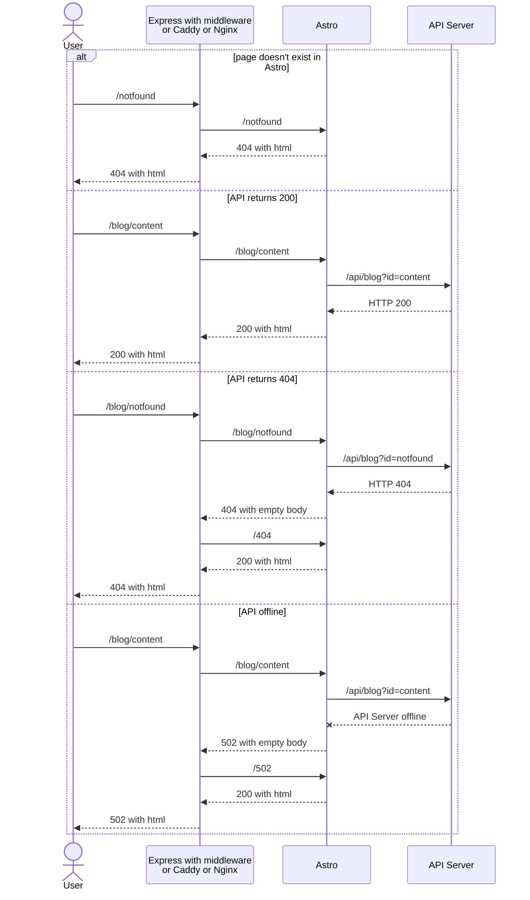

# demo for returning content of another page

Goal:

- When user visits `/blog/notfound`, they should see the same page as `/why-are-you-here` or any other page that doesn't exist.
- When user visits `/blog/fail`, they should see the same page as `/502`.

